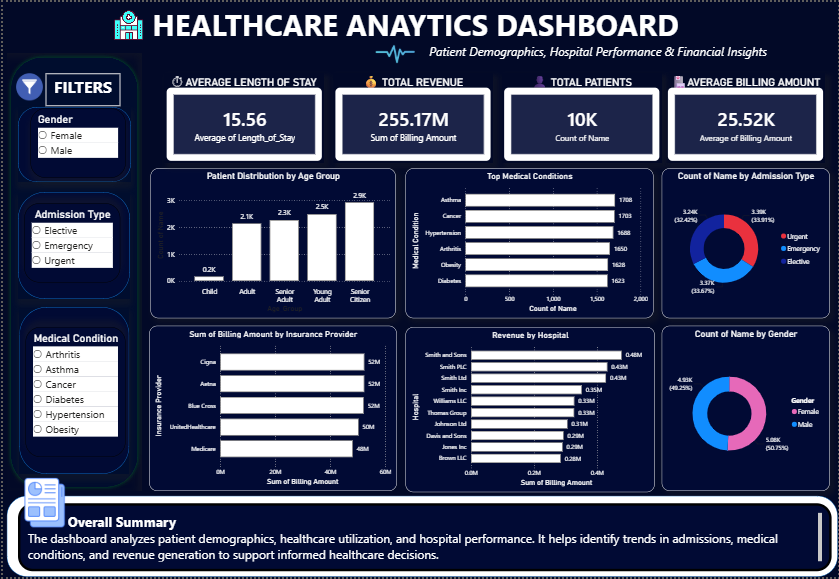

# 🏥 Healthcare Analytics Dashboard

## 📌 Project Overview

This project analyzes **10,000 healthcare records** to uncover insights related to patient demographics, medical conditions, hospital performance, admissions, and financial metrics.

The project follows an end-to-end data analytics workflow using **SQL for data analysis, Python for data cleaning and feature engineering, and Power BI for interactive data visualization**.

---

## 📊 Dashboard Preview

### Healthcare Analytics Dashboard



The dashboard provides an interactive overview of patient demographics, healthcare utilization, medical conditions, hospital revenue, admissions, insurance providers, and billing patterns.

---

## 🎯 Objectives

- Analyze patient demographics and healthcare utilization patterns.
- Identify trends in medical conditions and admissions.
- Evaluate hospital performance using revenue-related metrics.
- Analyze insurance provider billing patterns.
- Calculate important healthcare metrics such as average billing amount and length of stay.
- Build an interactive Power BI dashboard for data-driven analysis.

---

## 🛠️ Tools & Technologies

| Tool | Purpose |
|---|---|
| **SQL (MySQL Workbench)** | Data querying and analysis |
| **Python (Pandas)** | Data cleaning and feature engineering |
| **Power BI** | Interactive dashboard and visualization |
| **VS Code** | Python development |

---

## 📁 Dataset Information

The dataset contains **10,000 patient records**.

### Key Features

- Age
- Gender
- Medical Condition
- Hospital
- Billing Amount
- Insurance Provider
- Admission Type
- Test Results
- Date of Admission
- Discharge Date

---

## 🐍 Python Data Preparation

Python and Pandas were used to prepare the healthcare dataset for analysis.

### Data Preparation Steps

- Loaded and explored the dataset using Pandas.
- Checked for missing values and duplicate records.
- Converted date columns into datetime format.
- Created a **Length of Stay** feature using admission and discharge dates.
- Categorized patients into different **Age Groups**.
- Performed exploratory data analysis.
- Exported the cleaned dataset for further analysis and visualization.

---

## 🗄️ SQL Analysis

MySQL was used to query the healthcare dataset and perform analytical calculations.

### Analysis Performed

- Analyzed revenue generated by hospitals.
- Identified the most common medical conditions.
- Examined admission type distributions.
- Evaluated insurance provider trends.
- Explored patient demographic patterns.
- Calculated average billing amounts.
- Analyzed patient distribution across hospitals.
- Examined healthcare utilization patterns.

---

## 📊 Power BI Dashboard

The Power BI dashboard provides an interactive overview of the healthcare dataset.

### Dashboard Components

- **Average Length of Stay**
- **Total Revenue**
- **Total Patients**
- **Average Billing Amount**
- **Patient Distribution by Age Group**
- **Top Medical Conditions**
- **Admission Type Distribution**
- **Revenue by Insurance Provider**
- **Revenue by Hospital**
- **Gender Distribution**

### Interactive Filters

The dashboard allows users to explore the data using filters for:

- Gender
- Admission Type
- Medical Condition

---

## 💡 Key Insights

- Healthcare utilization varies across different age groups.
- Several medical conditions account for a significant portion of patient records.
- Hospital revenue varies across healthcare facilities.
- Patients are distributed across elective, emergency, and urgent admission types.
- Insurance providers contribute differently to overall healthcare billing.
- Patient distribution across genders is relatively balanced.

---

## 📈 Skills Demonstrated

- SQL querying and data analysis
- Data cleaning and preprocessing
- Feature engineering
- Exploratory data analysis
- Data visualization
- Power BI dashboard development
- Healthcare data analysis
- Business insight generation
- Data interpretation

---

## 📂 Repository Structure

```text
Healthcare-Analytics-Dashboard/
│
├── dashboard/
│   └── Healthcare-Analytics-Dashboard.png
│
├── python/
│   └── healthcare_analysis.py
│
├── sql/
│   └── healthcare_analysis.sql
│
├── powerbi/
│   └── Healthcare-Analytics-Dashboard.pbix
│
├── data/
│   └── healthcare_cleaned.csv
│
└── README.md
```

---

## 🚀 Future Improvements

- Add time-based analysis of admissions and revenue.
- Develop additional hospital performance metrics.
- Add predictive analytics for healthcare trends.
- Add more advanced Power BI measures and KPIs.
- Automate data refresh for the dashboard.

---

## 👩‍💻 Author

**Tanvi Kishorkumar Kotian**

BCA Student

GitHub: https://github.com/tanvikotian
